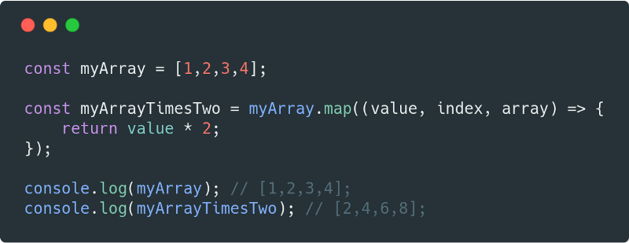
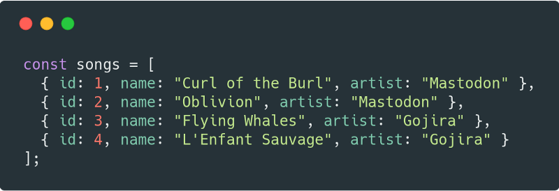
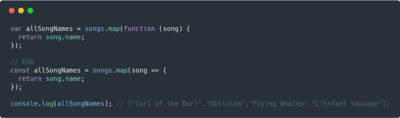
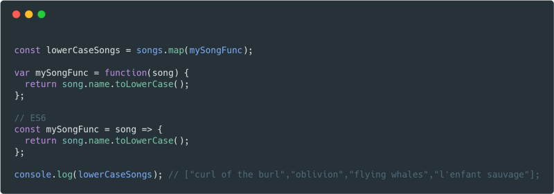
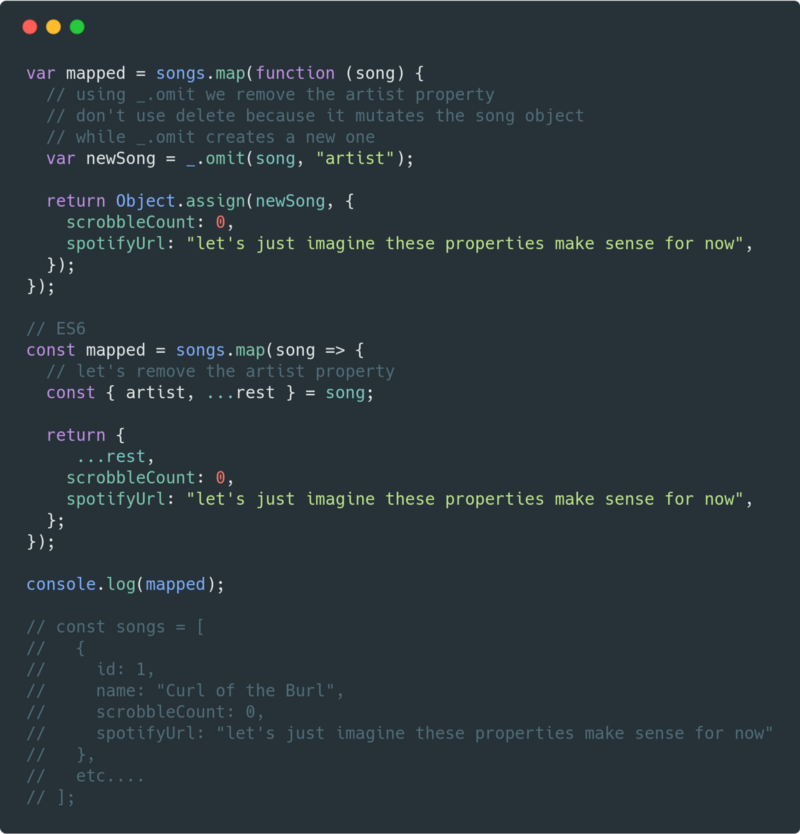

# 함수형 프로그래밍이란?

* 함수의 출력 값이 오직 함수로 넘어온 argument에만 의존하는 프로그래밍.

# 왜 Map, Filter, Reduce를 써야 할까?
## Map
 
* 배열 내부 프로퍼티를 각각 수정하거나 추가하기 편해서
  

## Map 사용방법
다음은 가장 기본적인 호출 방법이다.

> 모든 수를 2로 곱한다.

 
위에서 볼 수 있듯, map은 인자로 콜백을 받는다. map이 호출될 때, 이 콜백에 현재값의 iteration, iteration의 index 그리고 원본 배열이 주어진다. map을 위한 optional한 두번째 인자도 있다. 두번째 인자는 콜백 내부에서 this를 이용하기 위한 값이다.
  

## 예제
자바스크립트 오브젝트의 배열을 가정해보자.

> songs 배열이 있다.

* 오브젝트의 배열을 간단하게 스트링의 배열로 바꾸기

> map을 이용하여 모든 song의 이름을 가져온다.

* 유틸 함수를 이용하여 변화 적용하기

> 맵과 함께 유틸 함수를 이용하여 모든 song의 name을 소문자로 바꾸어준다.

* 주어진 배열을 변화시키고, 각각의 오브젝트의 프로퍼티를 추가/삭제 하기

> artist 프로퍼티를 제거하고 다른 프로퍼티를 추가했다.

