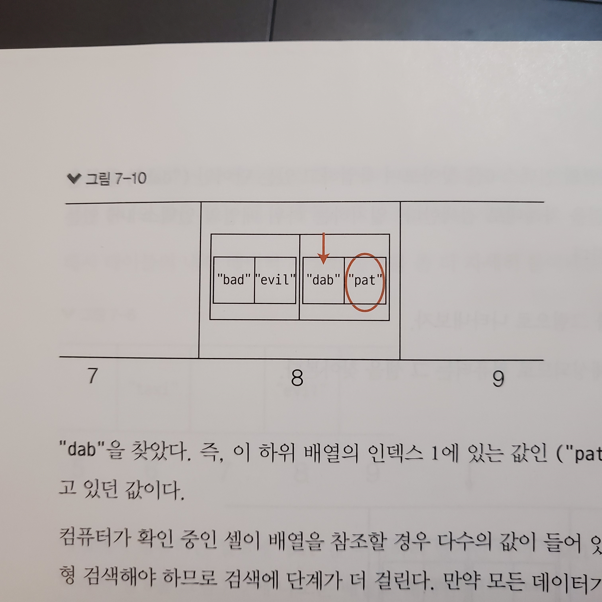

# 2일차 학습정리

## 1. 프로토타입
자바스크립트에서 함수를 만들면 프로토타입 오브젝트라는 것이 생성된다. 이 오브젝트는 우리 함수를 다시 가리키는 constructor 프로퍼티와 오브젝트인 또 다른 프로퍼티 __proto__를 갖고 있다. 그 안에는 엄청나게 많은 메서드들이 포함되어 있다.
 
생성자 함수의 새로운 인스턴스가 생성될 때마다, 다른 프로퍼티, 메소드와 함께 이 프로퍼티(proto)도 인스턴스에 복사된다.
 

이 프로토 오브젝트는 생성자 함수에 새로운 프로퍼티와 메소드를 추가하기 위해 사용될 수 있다. 다음 문법을 사용하면 모든 생성자 함수 인스턴스에서 사용 가능하다.
```
Toyota.__proto__.year = “2016”
```
프로토타입의 단점은 프로토타입 메서드와 프로퍼티는 모든 생성자 함수 인스턴스 간에 공유가 되지만, 생성자 함수의 인스턴스 중 하나에서 어떤 원시(primitive) 프로퍼티를 변경했을 때는, 해당 인스턴스에만 반영이 되고, 다른 인스턴스들 사이에서는 반영이 안됌.
 
또, 참조 타입 프로퍼티는 항상 모든 인스턴스 사이에서 공유된다는 걸 잊지 말자. 배열 타입 프로퍼티의 경우, 만일 생성자 함수의 한 인스턴스에 의해 수정되었다면, 모든 인스턴스에 대해 수정된다.
<br></br>


## 2. 클래스

### 1. 생성자 
클래스 선언에서 생성자는 특별한 함수이다. 생성자는 클래스 자체를 표현하는 함수를 정의한다. New 키워드를 쓰면 생성자는 자동으로 호출된다. 클래스당 생성자는 1개만.
### 2. 정적 메소드
클래스 자체에 있는 함수. 정적 메소드의 대부분은 공용 함수(utility functions)를 만들기 위해 사용된다. 정적 메소드들은 클래스의 인스턴스를 생성하지 않고 호출된다. 

### 3. Getters/Setters
클래스는 또 프로퍼티의 값을 가져오거나/프로퍼티의 값을 설정하기 위해 getters/setters를 가질 수 있다. 

<br></br>

## 3. 해시테이블 충돌 해결

* 오늘 하루 고민했던 건 위 그림 한방에 풀렸다. 
* 어떻게 코드로 구현할지만 연습해보자.